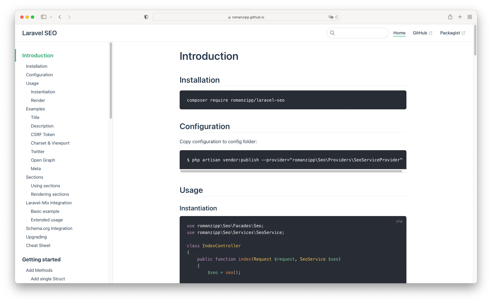

# Laravel SEO

[](https://packagist.org/packages/romanzipp/laravel-seo)
[](https://packagist.org/packages/romanzipp/laravel-seo)
[](https://packagist.org/packages/romanzipp/laravel-seo)
[](https://github.com/romanzipp/Laravel-SEO/actions)

A SEO package made for maximum customization and flexibility.

## Documentation

The full package documentation can be found on [romanzipp.github.io/Laravel-SEO](https://romanzipp.github.io/Laravel-SEO/)



## Testing

```
./vendor/bin/phpunit
```

## License

The MIT License (MIT). Please see [License File](LICENSE.md) for more information.
